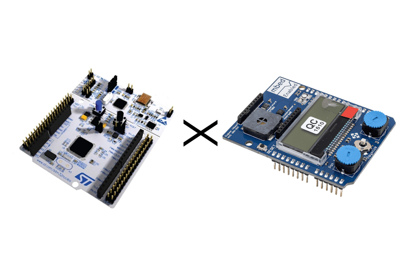
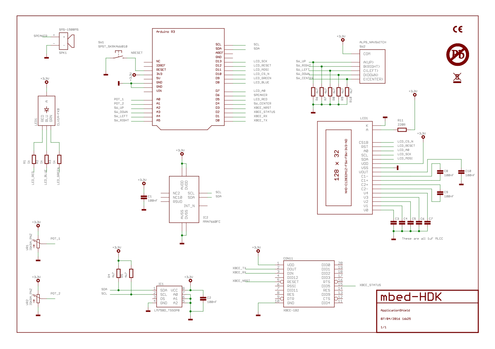
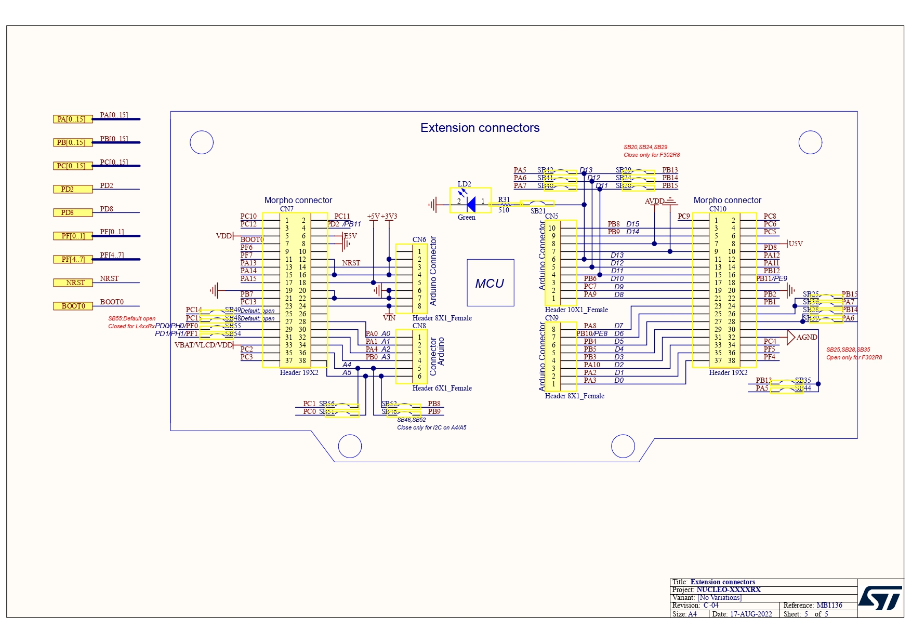

# NucleoF411RE-ApplicationShield

## 🚀 Overview


**NucleoF411RE-ApplicationShield** is an open-source firmware project designed to leverage the **Nucleo-F411RE** development board in conjunction with the **Application Shield** from ARMmbed. This project explores all the functionalities offered by the combination of the Nucleo-F411RE and the Application Shield, providing a comprehensive codebase for testing and demonstrating the capabilities of the microcontroller.

## 🎯 Purpose
- 🔌 **GPIO Control**: Interact with GPIO pins for reading, writing values, and generating PWM signals.
- ⏱️ **Timer Management**: Utilize timers to detect short and long button presses.
- ⚡ **Interrupt Handling**: Implement timer and button press interrupts for dynamic LED control.
- 💬 **Serial Communication**: Facilitate communication between the computer and the Nucleo board.
- 🌡️ **Sensor Interaction**: Communicate via I2C and SPI to gather data from sensors and control displays.
- 🔄 **ADC Utilization**: Read analog values from potentiometers.

## 📝 Features
| 🏷️ Feature                | 🔍 Description                                 |
|--------------------------|-----------------------------------------------|
| 💡 **GPIO Control**       | Read/write values and generate PWM signals.   |
| ⏲️ **Timer Management**    | Manage timers TIM2 to TIM5 for button presses. |
| ⚠️ **Interrupts**         | Use interrupts for LED blinking and button actions. |
| 💻 **Serial Communication** | Communicate with the Nucleo board via serial. |
| 🌡️ **I2C Communication**  | Retrieve temperature from the LM75 sensor and interact with MMA7660 accelerometer. |
| 📺 **SPI Communication**   | Control an LCD display using SPI.             |
| 🎚️ **ADC Usage**         | Read potentiometer angles through ADC.        |

## ApplicationShield Schematic


## Nucleo-F411RE Extension Schematic


## 🎛️ Example Applications

### 1. **PWM via LED**
Utilize **PWM (Pulse Width Modulation)** to control the brightness of an LED. By adjusting the duty cycle, the LED can be dimmed or brightened, allowing for various visual effects. This is particularly useful for applications such as light dimming or motor speed control.

### 2. **GPIO Input via Joystick**
Use the **GPIO** to read the logical levels from the joystick. The program update outputs such as LEDs based on the current status of the joystick buttons.

### 3. **ADC Potentiometer Reading**  
Use the **ADC (Analog-to-Digital Converter)** to read values from a potentiometer. These values can then be used to control parameters such as the brightness of an LED through **PWM (Pulse-Width Modulation)**, allowing the LED intensity to vary according to the potentiometer’s position.

### 4. **PWM via Speaker**
Utilize **PWM (Pulse Width Modulation)** to generate sounds via a speaker. By varying the **frequency**, not the duty cycle, different tones can be produced. The duty cycle remains constant while frequency changes create distinct audible notes. This method is commonly used for sound generation and simple audio signals."

### 5. **LED Blinking with Interrupts**
Implement **interrupt-driven blinking** of an LED based on timer events or button presses. This can be useful in applications where you want to signal an event with an LED, without continuously checking the button state.

### 6. **Serial Communication**
Establish **serial communication** between the Nucleo-F411RE and a PC for data exchange. This can be used for debugging, sending sensor readings, or receiving commands from the computer.

### 7. **I2C Temperature Reading**
Use the **I2C protocol** to communicate with temperature sensors such as the LM75. This data can then be used for environmental monitoring or to trigger actions based on temperature thresholds.

### 8. **SPI LCD Control**
Use the **SPI protocol** to control an LCD display. This application could display system status, sensor readings, or any other relevant information on a small screen.

## 📜 Code Structure
```bash
📁 NucleoF411RE-ApplicationShield/
├── 📂 Core/
│   ├── main.c        # Main firmware loop
│   ├── gpio.c        # GPIO handling and PWM
│   ├── timers.c      # Timer management
│   ├── interrupts.c  # Interrupt handling
│   ├── serial.c      # Serial communication control
│   ├── i2c.c         # I2C communication
│   ├── spi.c         # SPI communication for LCD
│   ├── adc.c         # ADC handling
├── 📂 Drivers/        # Nucleo HAL libraries
├── 📂 Inc/           # Header files
├── 📂 Assets/        # UI elements, example configurations
└── README.md         # This file
```

## 🌟 License
This project is open-source. Feel free to use, modify, and contribute! 🚀
